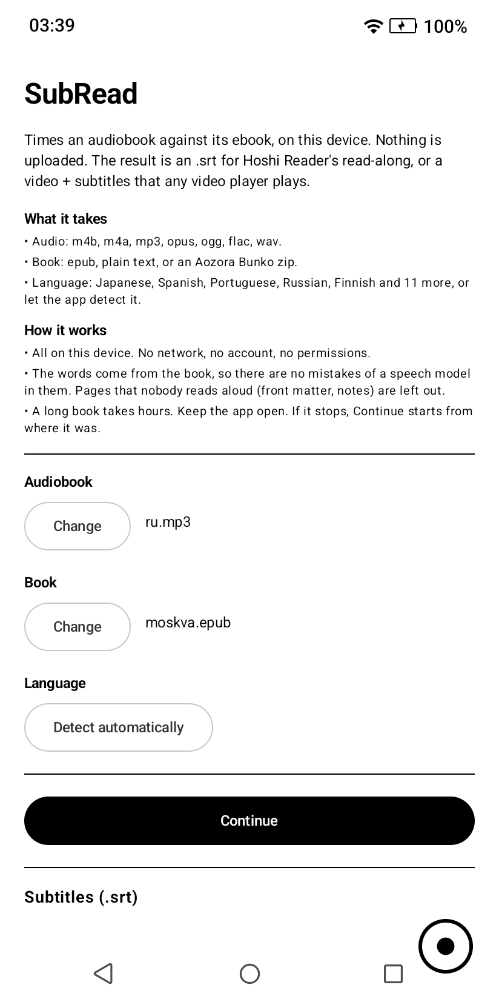
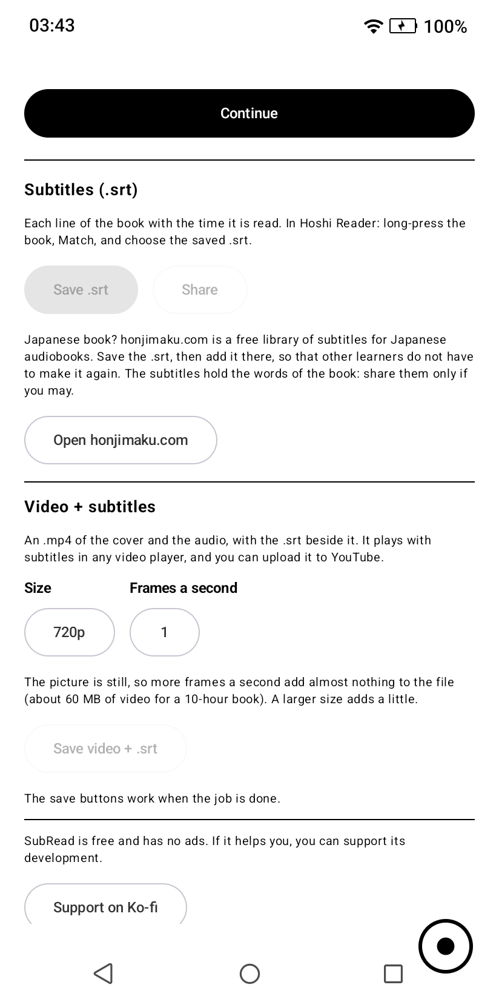

# SubRead for Android

Times an audiobook against its ebook, entirely on the phone, and writes the
`.srt` that [Hoshi Reader](https://github.com/HuangAntimony/Hoshi-Reader-Android)'s
read-along uses. Nothing is uploaded.

It also makes **videos + subtitles which can be played with any video player or
uploaded to YouTube**: an `.mp4` of the book's cover and the audio, with the
`.srt` beside it under the same name.

<p>
  
  
</p>

It is the same method as [subread.space](https://subread.space) and
[SubPlz](https://github.com/kanjieater/SubPlz): a small speech model transcribes
the audio, roughly; the transcript is aligned against the book; the subtitles
take their *timing* from the transcript and their *words* from the book.

## Layout

| Path | What |
|---|---|
| `core/` | The alignment engine. Plain Kotlin, no Android - builds and tests with only a JDK |
| `app/` | The Android app: audio decoding, the whisper.cpp bridge, the long-running job, the UI |
| `third_party/whisper.cpp` | Pinned submodule |
| `tools/make_golden.py` | Generates test fixtures by running the reference Python implementation |

## The engine

`core/` is a port of SubPlz's aligner (`ats.align`, `subplz.align.shift_align`),
checked stage by stage against the original's real output on real Whisper-tiny
transcripts: every cue across the fixtures comes out identical.

What is new is `AnchoredAligner`. The reference hands Biopython one chapter at a
time and needs gigabytes to do it, so it has to guess first which chapter of the
book each chapter of audio is. This aligns the whole book at once instead, by
anchoring on stretches unique to both texts and solving exactly only between
anchors: a 19-hour audiobook against its full text in a few seconds and a few
megabytes. `BookAligner` then uses the alignment itself to leave out text nobody
narrated - front matter, notes - instead of matching chapters.

```bash
./gradlew :core:test
```

## The video

The picture of the video does not change, so almost none of it is encoded.
The device's H.264 encoder makes one key frame. `H264Still` writes each frame
after it by hand: a P slice in which each macroblock is skipped, about ten
bytes. One minute of these frames is written again and again with new time
stamps. AAC audio is copied; other audio is encoded to AAC once.

The result for a 10-hour book is about 60 MB of video at 720p and one frame a
second. The frame rate adds about 20 bytes for each frame. The size of the
picture changes only the key frame, one each minute. The sizes on offer are
those the device has an encoder for (1080p in software, more with a hardware
encoder). No Android encoder makes 4K or 8K H.264 today.

## Building the app

CI builds it (`.github/workflows/build.yml`): the APK is an artifact of every
push to `main`. Locally it needs the Android SDK, NDK 29 and CMake 3.31. Without
an SDK, Gradle leaves `:app` out and `:core` still builds.

The speech model (`app/src/main/assets/models/ggml-tiny-q8_0.bin`, 43 MB, MIT
licence) is in the repository. It is the file of the whisper.cpp project, and
the workflow checks its hash. It is in git and not downloaded by the build, so
that a build needs no network: F-Droid asks for that, and the app itself has no
network permission.

The release key is not in the repository; CI reads it from Actions secrets.

## Releases

Each release is a tag (`vMAJOR.MINOR.PATCH`) and a GitHub release with the signed
APK attached. Set `versionName` (the tag without the `v`) and `versionCode` in
`app/build.gradle.kts` first, and write `fastlane/metadata/android/en-US/changelogs/<versionCode>.txt`:

```bash
./gradlew :app:assembleRelease
git tag -a v0.2.0 -m "what changed" && git push origin main --tags
gh release create v0.2.0 app/build/outputs/apk/release/app-release.apk --notes "what changed"
```

`versionCode` must go up every release, or Android refuses the update.

### Google Play

```bash
./gradlew :app:bundleRelease -PplayStore=true
```

`-PplayStore=true` leaves the Ko-fi link out. Each other build has it. The texts,
the graphics and the answers to the Console's questions are in `play/`.

### F-Droid

The build has what F-Droid asks for: free licences only, no network at build
time, no Google dependency list in the APK, and the version as plain numbers in
the build file. F-Droid reads the listing from `fastlane/metadata/android/`, and
finds new releases by their tags. `fdroid/space.subread.app.yml` is the recipe
for a merge request to [fdroiddata](https://gitlab.com/fdroid/fdroiddata).
F-Droid signs its builds with its own key, so an install from F-Droid and one
from GitHub or Google Play do not update each other.

## Requirements

Android 8+, a 64-bit ARM processor with ARMv8.2 half-precision and dot-product
instructions (anything from 2018 on). Transcription runs at a small multiple of
real time, so a long book takes hours. The job runs only while the app is open
and keeps the screen on. An interrupted job continues from its last finished chunk.

## Licence

AGPL-3.0: see `LICENSE`. You may use, change and host this, and you must give
your users the source of what you host. `NOTICE` has the licences of the work
this is built on (SubPlz, whisper.cpp, Whisper).
